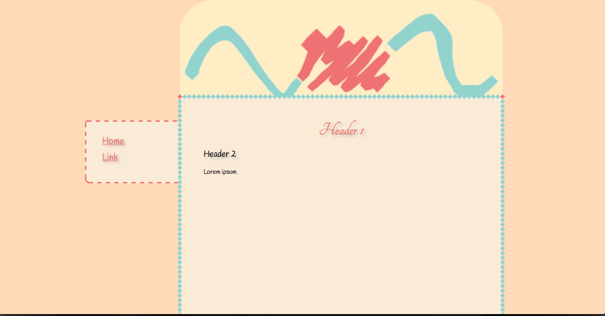

# What this is
This is a css template for a cute pastel-coloured website. The website works well under Firefox and Chrome, but not under IE because, at the time, it had not yet implemented some html5 features. The logo image on top needs to be changed and can look nice with a little effort.

# License
You can use this according to the [CC-BY-SA license](https://creativecommons.org/licenses/by-sa/4.0/).